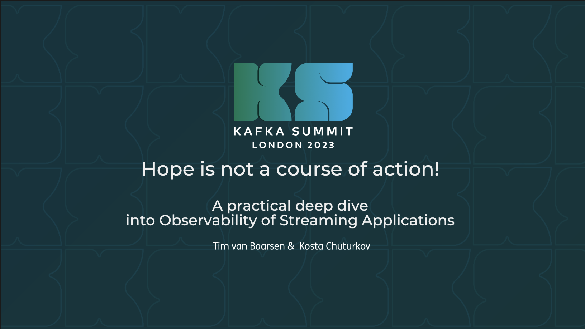

# Kafka Summit 2023 - Hope is not a course of action!



A practical deep dive into the Observability of Streaming Applications 

* [Slides](https://speakerdeck.com/timvanbaarsen/kafka-summit-london-2023-hope-is-not-a-course-of-action)
* [Recording](https://www.confluent.io/events/kafka-summit-london-2023/observability-of-streaming-applications/)

Demo code base used during our Kafka Summit London 2023 talk.
Speakers: Kosta Chuturkov & Tim van Baarsen 

* [Demo 1 - Client side metrics by Tim](demo-1.md)
* [Demo 2 - Open Telemetry by Kosta](demo-2.md)

## Project modules and applications

| Applications          | Port | Avro | Topic(s)                                                                                                  | Description                                                                                                |
|-----------------------|-----|------|-----------------------------------------------------------------------------------------------------------|------------------------------------------------------------------------------------------------------------|
| spring-kafka-producer | 8080 | YES  | `stock-quotes`                                                                                            | Simple producer of random stock quotes using Spring Kafka & Apache Avro.                                   |
| spring-kafka-consumer | 8082 | YES  | `stock-quotes`                                                                                            | Simple consumer of stock quotes using using Spring Kafka & Apache Avro.                                    |
| spring-kafka-streams  | 8083 | YES  | `stock-quotes`, `stock-quotes-exchange-nyse`, `stock-quotes-exchange-nasdaq`, `stock-quotes-exchange-ams` | Simple Kafka Streams application using Spring Kafka & Apache Avro.                                         |
| plain-kafka-consumer  | -   | YES  | `stock-quotes-exchange-nyse`, `stock-quotes-exchange-nasdaq`, `stock-quotes-exchange-ams`                 | Simple 'plain' Kafka consumer application                                                                  |
| shaky-downstream-service  | 7999    | NO   | not using Kafka                                                                                           | Simple Spring Boot (slow and shaky) Rest API used to build up some artificial consumer lag in the consumer. |

| Module     | Description                                                                                                                                                                                             |
|------------|---------------------------------------------------------------------------------------------------------------------------------------------------------------------------------------------------------|
| avro-model | Holds the Avro schema for the Stock Quote including `avro-maven-plugin` to generate Java code based on the Avro Schema. This module is used by both the producer, consumer and Kafka streams application. |

Note Confluent Schema Registry is running on port: `8081` using Docker see: [docker-compose.yml](docker-compose.yml).

| Component           | Description                             | Url                                                            | Category |
|---------------------|-----------------------------------------|----------------------------------------------------------------|----------|
| Grafana - Tempo     | Distributed tracing shown in Grafana    | [http://localhost:3000/explore](http://localhost:3000/explore) | Tracing  |
| Tempo               | Distributed tracing backend             | [http://localhost:3200/status](http://localhost:3200/status)   | Tracing  |
| Jaeger              | Distributed tracing backend             | [http://localhost:16686/](http://localhost:16686/)             | Tracing  |
| Prometheus          | Time series databasee (Metrics backend) | [http://localhost:9090](http://localhost:9090)                 | Metrics  |
| Prometheus (status) |                                         | [http://localhost:9090/status](http://localhost:9090/status)   | Metrics  |
| Conduktor           | `admin@conduktor.io` password: `admin`  | [http://localhost](http://localhost)                           | UI       |
| Schema Registry     | Confluent Schema Registry (AVRO)        | [http://localhost:8081](http://localhost:8081)                 | Schema   |

## Version

* Confluent Kafka: 7.3.x
* Confluent Schema Registry: 7.3.x
* Java: 19
* Spring Boot: 3.0.6
* Spring for Apache Kafka: 3.0.6
* Apache Avro: 1.11.x

## Build

### Mvn project

```
./mvnw clean install
```

## Docker images for the applications

```bash
docker-compose -f docker-compose.yml  -f docker-compose-applications.yml build
```

Or run script:

```bash
./buildDockerImages.sh
```

## Run the examples

 
### Infrastructure only

```bash
docker-compose up -d
```

To shutdown:

```bash
docker-compose down -v
```

### With Open Telemetry agent

```bash
docker-compose -f docker-compose.yml -f docker-compose-applications.yml up -d
```

To shutdown:

```bash
docker-compose -f docker-compose.yml -f docker-compose-applications.yml down -v
```

### Run with Micrometer

```bash
docker-compose -f docker-compose.yml -f docker-compose-micrometer.yml up -d
```

To shutdown:

```bash
docker-compose -f docker-compose.yml -f docker-compose-micrometer.yml down -v
```

### Confluent Control Center & Confluent Monitoring interceptors

```bash
./mvnw clean install -Pmonitoring-interceptors
```

```bash
docker-compose -f docker-compose.yml -f docker-compose-control-center.yml up -d
```

```bash
./mvnw -P monitoring-interceptors spring-boot:run -pl spring-kafka-producer -Dspring-boot.run.arguments="--spring.profiles.active=monitoring-interceptors"
```

```bash
./mvnw spring-boot:run -pl shaky-downstream-service
```

```bash
./mvnw -P monitoring-interceptors spring-boot:run -pl spring-kafka-consumer -Dspring-boot.run.arguments="--spring.profiles.active=monitoring-interceptors"
```

[Confluent Control Center](http://localhost:9021)

To shutdown:

```bash
docker-compose -f docker-compose.yml -f docker-compose-control-center.yml down -v
```
