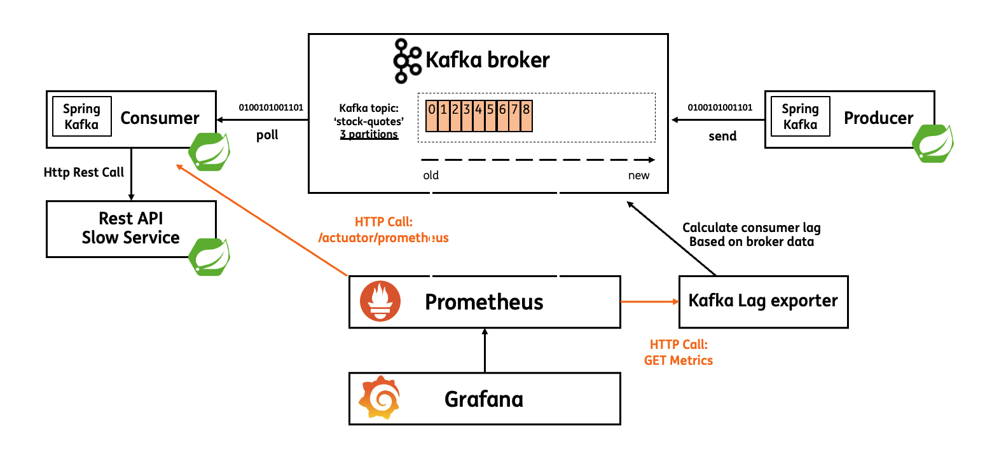
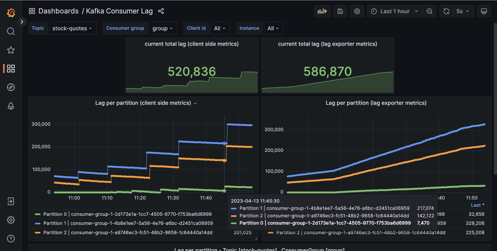

# Demo 1 (Tim)

Demo setup:



Dashboard



## Start infrastructure

```bash
docker-compose up -d
```

## Start producer

```bash
./mvnw spring-boot:run -pl spring-kafka-producer
```

## Start downstream service

```bash
./mvnw spring-boot:run -pl shaky-downstream-service
```

* [Grafana Consumer lag dashboard](http://localhost:3000/d/consumer-lag/kafka-consumer-lag-micrometer?orgId=1&refresh=5s)

## Start 1st instance of consumer

```bash
./mvnw spring-boot:run -pl spring-kafka-consumer
```

## Start 2nd instance of consumer

```bash
./mvnw spring-boot:run -pl spring-kafka-consumer -Dspring-boot.run.arguments="--server.port=8084"
```

## Start 3rd instance of consumer

```bash
./mvnw spring-boot:run -pl spring-kafka-consumer -Dspring-boot.run.arguments="--server.port=8085"
```

